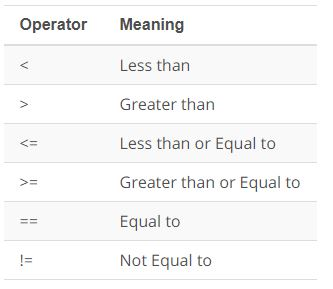
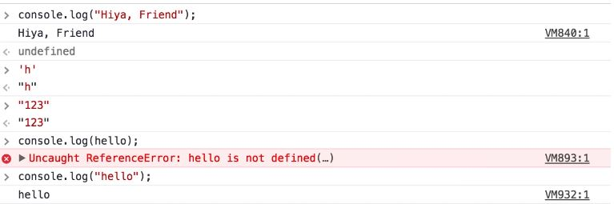
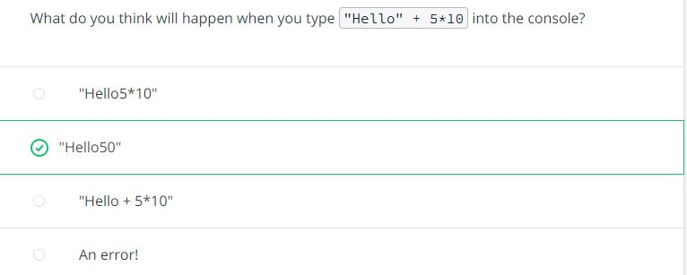
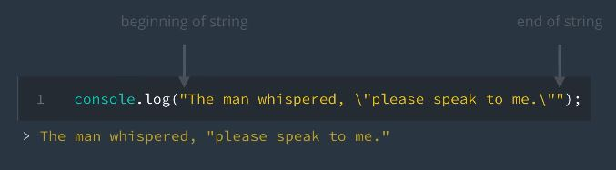
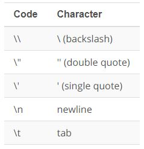
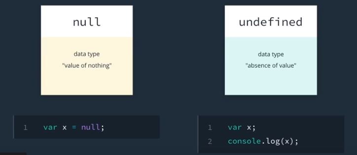
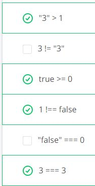
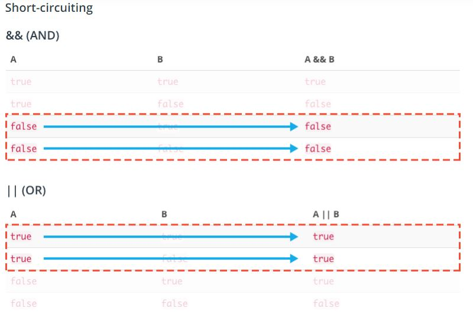

# JavaScriptBasicNotes-Udacity-
I created these notes primarily for my own convenience while taking Udacity's free JavaScript course

## JavaScript Console Shortcut: </br>


## Console Log:
Console log prints a string. Syntax:
````javascript
console.log("hiya friend!");
````

## Data Types
### Numbers 
Any positive or negetive integer and decimals. We can do on the fly arithmatic calculations with them on the browser. </br>
**Comparing Numbers:** Comaparing opeartions can be done on numbers. The result of the comparison will returned in boolean (true or false).</br>


### Strings
We have to use the same quote (' ' or " ") for the String datatype in JS. Strings won't work without quotes. </br>


### String Concat
Strings can be concatenated with other strings with the **+** operator. Strings can be concatanated with arithmaic operations of numbers as well. For example: </br>


### Escaping Characters
Backlash **"\\"** is used to escape the special meaning of characters such as quotes. 
 </br>
Some other special characters are: </br>


### String Comparisons
String comparisons are case sensetive. **"Yes" == "yes"** -this code above will return _false_ in the console.


### String Index
String indexing starts from **0**. Spaces are valid characters and take up indexes in strings.

## Variables
For JS variables we use the **var** keyword. It can be used for any kind of data type. For example: </br>
````javascript
var afterTax = 500.00; //use camelCase for varibale names (convention) </br>
var name = "zoe";
````
## Null, Undefined, NaN
### Null
It means value of nothing.
### Undefined
It means a value has not been assigned to a variable.

### NaN
NaN stands for "Not-A-Number" and it's often returned indicating an error with number operations. For instance, if you wrote some code that performed a math calculation, and the calculation failed to produce a valid number, NaN might be returned. Example:
````javascript
Math.sqrt(-10);
````
## Implicit type coercion
Javascript isa loosly typed language, meaning it can interpete data types.
````javascript
1 == "1" 
```` 
The code above will return true. Some more examples: </br>


### Conditionals
## Short Circuiting



