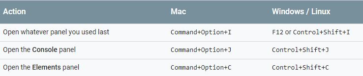

# JavaScriptBasicNotes-Udacity-
I created these notes primarily for my own convenience while taking Udacity's free JavaScript course

## JavaScript Console Shortcut:  

## Console Log:
Console log prints a string. Syntax:
_console.log("hiya friend!");_

## Data Types
### Numbers 
Any positive or negetive integer and decimals. We can do on the fly arithmatic calculations with them on the browser.  
**Comparing Numbers:** Comaparing opeartions can be done on numbers. The result of the comparison will returned in boolean (true or false). 

### Strings
We have to use the same quote (' ' or " ") for the String datatype in JS. Strings won't work without quotes.  

### String Concat
Strings can be concatenated with other strings with the **+** operator. Strings can be concatanated with arithmaic operations of numbers as well. For example:  

